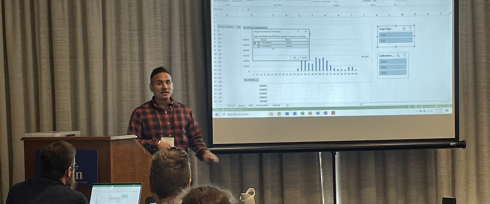

::: {.home-banner}

:::

::: {.home-intro}

# Welcome to my portfolio!

I am a spatial data scientist and public health professional working at the intersection of geographic information systems, mosquito control, remote sensing, and field operations.

I build geospatial tools and analytical workflows that connect surveillance, remote sensing, and field operations. My work helps organizations transform complex data to clear, defensible actions.

I currently lead technical development at Collier Mosquito Control District, where I work across GIS, spatial analytics, unmanned aircraft systems, and operational mosquito control.

:::

::: {.home-sections}

::: {.home-section}
## About

This is my professional portfolio. It brings together selected work in spatial data science, GIS, UAS, remote sensing, and public health operations.

For more about my background and how I came to this work, visit the [About page](about.qmd) or [download my CV](assets/about/Atom_Rosales_Resume.pdf).
:::

::: {.home-section}
## Connect

- Email me at [atommrosales@gmail.com](mailto:atommrosales@gmail.com).
- Track my scholarly work on [ORCID](https://orcid.org/0000-0001-8702-1194).
- Find my publications on [Google Scholar](https://scholar.google.com/citations?user=OHq3Kv4AAAAJ&hl=en).
- See my code projects on [GitHub](https://github.com/atom-geo).
:::

:::
